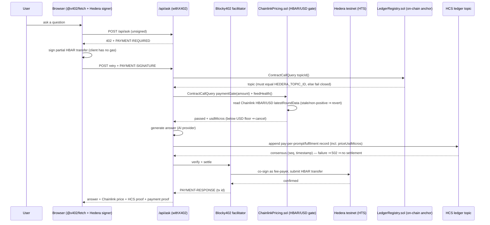

# ⚡ PayPerPrompt — a scaffold-hbar template

**Pay-per-question AI on Hedera.** Every answer is unlocked by a real HBAR payment through the official
[x402](https://github.com/x402-foundation/x402) exact scheme, settled via the
[Blocky402](https://blocky402.com) facilitator, priced on-chain against the **live Chainlink HBAR/USD oracle**
at the moment of the prompt, and — load-bearing — every fulfilled prompt is appended to a
public **HCS audit ledger** whose topic id is pinned **on-chain** by a tiny Solidity registry
(`LedgerRegistry`). No subscriptions, no credit cards, no stored AI keys.

This repository is structured as a [scaffold-hbar](https://github.com/hedera-dev/scaffold-hbar) template:
`packages/contracts` (Hardhat + Solidity + Hedera SDK scripts) and `packages/frontend` (Next.js App Router),
plus a `template.json` manifest so it can be bootstrapped with a single command.

## 🪙 The load-bearing services

Four ecosystem services are genuinely load-bearing — the app refuses to work without them:

1. **HTS payment (x402 `exact`)** — HBAR is transferred to the receiver account only after the AI answer is
   verified, via the Blocky402 facilitator (`@x402/next` `withX402` + `@x402/hedera`).
2. **HCS audit ledger** — before an answer is returned, the server appends a JSON record
   (`pay-per-prompt/fulfilment`) to an HCS topic using its operator key. Append failure ⇒ `502` ⇒ x402
   cancels settlement, so a user is **never charged for an answer that wasn't recorded**.
3. **On-chain anchoring (Smart Contract Service)** — `packages/contracts/contracts/LedgerRegistry.sol`
   stores the ledger topic id immutably. The server reads `topicId()` from the deployed contract and
   **fails closed** if it disagrees with the environment value, so the ledger can't be silently repointed.
4. **Chainlink fair-price gate** — `packages/contracts/contracts/ChainlinkPricing.sol` reads the live
   Chainlink **HBAR/USD** AggregatorV3 (`0x59bC155EB6c6C415fE43255aF66EcF0523c92B4a` on Hedera testnet), computes
   each prompt's USD value **on-chain**, and enforces a floor. The oracle is consulted before any answer is
   generated: a stale, silent or non-positive feed, or a payment below the floor, cancels the prompt
   (fail closed). No oracle — no prompts. The Chainlink-priced USD value is written into every HCS record.

Every prompt produces two independent, publicly verifiable artifacts: the HBAR payment transaction and the
HCS ledger entry (both shown with HashScan + mirror-node links in the UI).

### Verifiable testnet proof (this template's live instances)

| Artifact                         | ID / link                                                                                                     |
| -------------------------------- | ------------------------------------------------------------------------------------------------------------- |
| HCS ledger topic                 | `0.0.10696735` — https://hashscan.io/testnet/topic/0.0.10696735                                               |
| On-chain anchor (registry)       | `0.0.10696739` — https://hashscan.io/testnet/contract/0.0.10696739                                            |
| Chainlink fair-price gatee       | `0.0.10730509` — https://hashscan.io/testnet/contract/0.0.10730509                                            |
| Chainlink HBAR/USD feed (live)   | `0x59bC155EB6c6C415fE43255aF66EcF0523c92B4a` — 8 decimals, round updated within the 1h freshness window       |
| Sample HCS record (seq 1)        | https://hashscan.io/testnet/topic/0.0.10696735/message/1                                                      |
| Real settled payment             | `0.0.7162784-1790258955-089794902` — https://hashscan.io/testnet/transaction/0.0.7162784-1790258955-089794902 |
| Real HCS record (seq 2)          | https://hashscan.io/testnet/topic/0.0.10696735/message/2                                                      |
| Real Chainlink-priced payment    | `0.0.7162784-1790432038-882481438` — https://hashscan.io/testnet/transaction/0.0.7162784-1790432038-882481438       |
| Real Chainlink-priced HCS record | https://hashscan.io/testnet/topic/0.0.10696735/message/8                                                            |
| Payment via freshly scaffolded copy | `0.0.7162784-1790432480-961738078` — https://hashscan.io/testnet/transaction/0.0.7162784-1790432480-961738078     |
| HCS record via scaffolded copy   | https://hashscan.io/testnet/topic/0.0.10696735/message/9                                                            |

The payment txs show exactly `0.0.9567368 −1,000,000` → `0.0.7932544 +1,000,000` tinybar (`0.01 HBAR`), matching
`amountTinybar` in the HCS records. Records 8 and 9 are priced **on-chain** with
`priceSource:"chainlink", priceUsdMicros:932, priceFeedRateUsdMicrosPerHbar:93244` — the ledger, the money and the
live oracle all agree. Seq 9 was produced by a **freshly scaffolded copy** of this template (proving the CLI
flow end to end). The gate is a live on-chain read (`eth_call paymentGate/feedHealth` against `0.0.10730509`,
or `ContractCallQuery` from the app), so anyone can re-verify it against HashIO JSON-RPC.

## 🚀 One-command scaffold

```bash
npm create scaffold-hbar@latest -- --template KaushalGoud/pay-per-prompt
```

The CLI validates `template.json`, copies the monorepo, fills in the prompted env vars (`.env.example`),
runs `npm install`, formats, and makes an initial git commit. Then:

```bash
cd pay-per-prompt
npm run setup:hedera    # creates the HCS topic + deploys registry and Chainlink price gate, prints .env lines
npm run dev             # http://localhost:3000
```

## 🛠️ Prerequisites

- **Node.js ≥ 20.18.3** + `npm` ≥ 10 (`checkCoreSystemRequirements`)
- A configured **git identity** (`git config user.name`, `user.email`)
- A Hedera **testnet** account funded with free testnet HBAR from the
  [Hedera portal faucet](https://portal.hedera.com/faucet) — used as operator _and_ demo payer
- An **OpenAI-compatible** API key (e.g. OpenAI, Groq)

## 📦 Environment variables

Copy `.env.example` → `.env` at the repo root. Both packages read it explicitly.

| Variable                                              | Purpose                                                  | Required                       |
| ----------------------------------------------------- | -------------------------------------------------------- | ------------------------------ |
| `HEDERA_NETWORK`                                      | `testnet` or `mainnet`                                   | no (default `testnet`)         |
| `HEDERA_ACCOUNT_ID`                                   | Operator account (signs HCS appends, deploys contract)   | yes                            |
| `HEDERA_PRIVATE_KEY`                                  | Operator ECDSA private key (raw hex)                     | yes                            |
| `HEDERA_MIRROR_NODE_URL`                              | Mirror node base URL                                     | no                             |
| `HEDERA_TOPIC_ID`                                     | HCS ledger topic (created by `setup:hedera`)             | yes                            |
| `HEDERA_CONTRACT_ID`                                  | `LedgerRegistry` contract (deployed by `setup:hedera`)   | yes\*                          |
| `HEDERA_PRICING_CONTRACT_ID`                          | `ChainlinkPricing` contract (deployed by `setup:hedera`) | yes\*                          |
| `CHAINLINK_PRICE_FEED`                                | Chainlink HBAR/USD AggregatorV3 address on testnet       | no (default testnet feed)      |
| `PRICING_MAX_STALE_SECONDS`                           | Feed freshness window before the gate fails closed       | no (default `3600`)            |
| `PRICING_MIN_USD_MICROS`                              | On-chain USD floor per prompt (USD·10⁻⁶)                 | no (default `500`)             |
| `RECEIVER_ACCOUNT_ID`                                 | Account that collects HBAR payments                      | yes                            |
| `PRICE_HBAR`                                          | Price per prompt (default `0.01`)                        | no                             |
| `X402_FACILITATOR_URL`                                | x402 facilitator                                         | no (default Blocky402 testnet) |
| `BLOCKY402_FEE_PAYER`                                 | Facilitator fee-payer account (`0.0.7162784`)            | recommended                    |
| `NEXT_PUBLIC_HEDERA_CLIENT_ACCOUNT_ID`                | Demo payer account (browser signer)                      | yes                            |
| `NEXT_PUBLIC_HEDERA_CLIENT_PRIVATE_KEY`               | Demo payer ECDSA key (browser signer)                    | yes                            |
| `NEXT_PUBLIC_PRICE_HBAR`                              | Mirrored price for the receipts UI                       | no                             |
| `OPENAI_API_KEY` / `OPENAI_BASE_URL` / `OPENAI_MODEL` | AI provider                                              | yes                            |

\* Contracts are deployed by `setup:hedera`; without them the topic id is trusted from the env only, and the
Chainlink gate refuses to price prompts (fail closed).

> **Security**: `.env` is gitignored. Never commit private keys. The in-browser payer key is a testnet-only
> stand-in; a production app would use a wallet (HashPack/HashConnect) so the key never enters the JS bundle.

## 🧩 Architecture



### Repository layout

```
pay-per-prompt/
├── template.json                 # scaffold-hbar manifest (capabilities, env vars, outro steps)
├── packages/
│   ├── contracts/                 # Hardhat + Hedera SDK
│   │   ├── contracts/LedgerRegistry.sol        # pins the HCS topic on-chain
│   │   ├── contracts/ChainlinkPricing.sol      # Chainlink HBAR/USD fair-price gate
│   │   ├── contracts/mocks/MockAggregator.sol  # feed test-double (offline tests only)
│   │   ├── scripts/setup.ts       # idempotent: topic + registry + pricing gate
│   │   ├── scripts/create-topic.ts / deploy-ledger-registry.ts / deploy-chainlink-pricing.ts / submit-test-message.ts
│   │   └── test/                  # LedgerRegistry.test.ts + ChainlinkPricing.test.ts
│   └── frontend/                  # Next.js App Router
│       ├── app/api/ask/route.ts   # withX402 + Chainlink-gated, HCS-audited answer
│       ├── app/api/health/route.ts
│       ├── app/api/ledger/route.ts
│       └── lib/                   # config.ts, ai.ts, hedera-ledger.ts, x402-server.ts, x402-hedera-client.ts
```

## 📖 Usage

```bash
npm install
npm run setup:hedera   # create HCS topic + deploy LedgerRegistry + ChainlinkPricing (idempotent)
npm run dev            # http://localhost:3000
```

Other scripts (workspace-aware): `npm run dev|build|start|lint|typecheck|format`, `npm run test` (Hardhat
tests, no network), `npm run test:testnet`, `npm run deploy:registry`, `npm run deploy:pricing`,
`npm run compile`.

## 🧪 Testing

- **Unit/integration (offline):** `npm run test` — Hardhat in-process EVM tests for `LedgerRegistry` and
  `ChainlinkPricing` (gate math, USD floor pass/fail, and fail-closed on stale/non-positive/8-decimal-mismatched
  feeds via a mock aggregator).
- **Lint/typecheck:** `npm run lint` and `npm run typecheck` cover both workspaces.
- **Health:** `curl http://localhost:3000/api/health` — green when receiver, price, AI, operator, topic,
  on-chain anchor, and the Chainlink gate all resolve (the anchor is read from the live contract and the gate
  from the live feed).
- **Ledger:** `curl http://localhost:3000/api/ledger` — recent `pay-per-prompt/fulfilment` records (now with
  Chainlink-priced USD value) and their mirror-node URLs.

## 🧰 Built a new project from this template?

1. Push this repo to GitHub (default branch `main`).
2. `npm create scaffold-hbar@latest -- --template <owner>/<repo>`.
3. Answer the env prompts (copied to `.env.example`), then run `npm run setup:hedera` and `npm run dev`.

## 📄 License

MIT — see [LICENSE](./LICENSE).

---

_Built for the Hedera scaffold-hbar template bounty. Uses the official `@x402/hedera`, `@x402/next`, and
`@x402/fetch` packages. Network: Hedera testnet._
