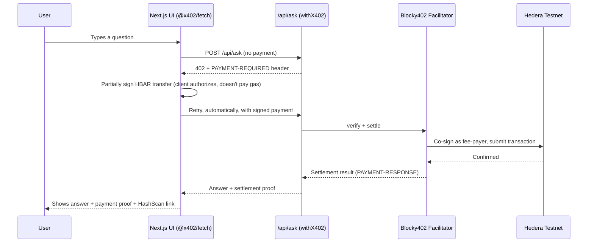

# ⚡ PayPerPrompt

**Pay-per-question AI, settled on Hedera — using the official x402 protocol.** No subscriptions. No stored API keys. No credit card. Every answer is unlocked by a real, client-signed HBAR payment, verified and settled through Hedera's own x402 ecosystem before you get a response.

Built for the [Hedera x402 Bounty](https://hedera.com/x402-bounty/) — this implements Hedera's official `exact` payment scheme via the published [`@x402/hedera`](https://github.com/x402-foundation/x402) package, settled through [Blocky402](https://blocky402.com), a live public Hedera facilitator.

[](https://hedera.com)
[](https://github.com/x402-foundation/x402)
[](https://nextjs.org)
[](./LICENSE)


## 🧩 The Problem

AI APIs today force a binary choice: **subscribe monthly, or don't use it at all.**

| Scenario | Why it fails today |
|---|---|
| **Occasional users** | Paying $20/month for 5 questions is a bad deal — most usage is wasted spend |
| **AI agents paying AI services** | Machine-to-machine commerce can't "enter a credit card" — traditional rails assume a human is present |
| **True micropayments** | Charging $0.01 through Stripe costs more in processing fees than the transaction itself |

Hedera's fixed, sub-cent transaction fees make **genuine per-use pricing** viable — down to fractions of a cent, no minimum spend, no invoicing.

## 💡 The Solution

**PayPerPrompt** gates every AI response behind a real Hedera testnet payment using **Hedera's official x402 `exact` scheme** — not a custom approximation. It uses the published `@x402/hedera`, `@x402/next`, and `@x402/fetch` packages exactly as Hedera's own documentation specifies, settled through **Blocky402**, a live, publicly-accessible Hedera facilitator.

## 🏗️ Architecture



### The fee-delegation model

Hedera's x402 `exact` scheme uses a **fee-payer delegation** pattern: the client signs a transfer of its own funds but does *not* pay the network fee — the facilitator co-signs as fee-payer and submits the transaction. This means:

- **The resource server never holds a private key** — payments are entirely handled by `@x402/next`'s `withX402` wrapper and the facilitator
- **The client never needs testnet HBAR for gas** — only enough to cover the actual payment amount
- Settlement only happens **after** verification succeeds, and (via `withX402`) only after the underlying API response itself succeeds — a failed AI call never charges the user

---

## 🛠️ Tech Stack

| Layer | Technology |
|---|---|
| Frontend | Next.js 14 (App Router), TypeScript, Tailwind CSS |
| Payment protocol | `@x402/core`, `@x402/hedera`, `@x402/next`, `@x402/fetch` — official x402 v2 packages |
| Facilitator | [Blocky402](https://blocky402.com) — live public Hedera testnet facilitator |
| Settlement network | Hedera Testnet (native HBAR, entity `0.0.0`) |
| AI | GPT-4o-mini (OpenAI-compatible endpoint) |

---

## 📁 Project Structure
pay-per-prompt/
├── app/
│ ├── api/ask/route.ts # withX402-wrapped resource server
│ ├── page.tsx
│ └── layout.tsx
├── components/
│ ├── ChatInterface.tsx # Uses @x402/fetch's wrapFetchWithPayment
│ ├── MessageBubble.tsx
│ ├── PaymentSidebar.tsx
│ └── PaymentTransactionItem.tsx
├── lib/
│ ├── x402-server.ts # x402ResourceServer + ExactHederaScheme registration
│ ├── x402-hedera-client.ts # Client signer + wrapFetchWithPayment
│ └── types.ts
└── .env # Hedera + AI provider config (not committed)
---

## 🚀 Getting Started

### Prerequisites

- Node.js 18+
- A Hedera testnet account funded with HBAR ([get one free](https://portal.hedera.com)) — this is your **client/payer** account only; you do **not** need a facilitator account, Blocky402 provides one
- An OpenAI-compatible API key

### Setup

```bash
git clone https://github.com/KaushalGoud/payperprompt.git
cd payperprompt
npm install
```

`.env`:
```dotenv
OPENAI_API_KEY=your_api_key
OPENAI_MODEL=gpt-4o-mini
OPENAI_BASE_URL=https://api.openai.com/v1

RECEIVER_ACCOUNT_ID=0.0.xxxxxxx
PRICE_HBAR=0.1
BLOCKY402_FEE_PAYER=0.0.7162784

NEXT_PUBLIC_HEDERA_CLIENT_ACCOUNT_ID=0.0.xxxxxxx
NEXT_PUBLIC_HEDERA_CLIENT_PRIVATE_KEY=your_ecdsa_hex_key
NEXT_PUBLIC_PRICE_HBAR=0.1
```

```bash
npm run dev
```

Open [http://localhost:3000](http://localhost:3000) and ask a question — `@x402/fetch` handles the entire payment flow automatically.

---

## 🔐 Security Notes

- `.env` is gitignored — never commit real private keys
- The client-side signing key is a demo stand-in exposed via `NEXT_PUBLIC_` — acceptable only for testnet demo purposes. A production version would use a real wallet (HashPack/HashConnect) so the key never enters the app's bundle
- **Facilitator trust**: this build relies on Blocky402 as a third-party facilitator. Hedera's own documentation notes facilitator concentration as a known ecosystem risk — a production deployment might run its own facilitator or support multiple, rather than depending on one

---

## 🗺️ Roadmap

- [ ] Replace the demo client key with real HashPack / HashConnect wallet integration
- [ ] Support HTS stablecoin payments alongside native HBAR
- [ ] Multi-facilitator fallback for resilience
- [ ] Public shared payment ledger view

---

## 🏆 Hedera x402 Bounty Submission

- **Standard used:** x402 v2, Hedera's official `exact` scheme (`@x402/hedera`)
- **Facilitator:** Blocky402 (live, public, testnet)
- **Network:** Hedera Testnet
- **Real on-chain transactions:** ✅ (see HashScan links above)

---

